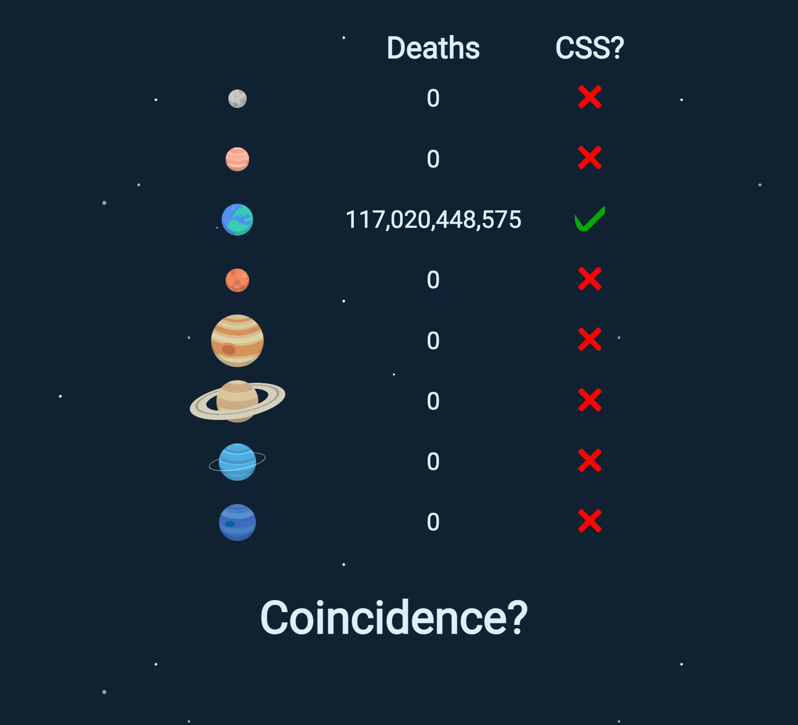

# CSS (en co) challenges

Op dinsdagen kennismaken en oefenen met CSS (en soms met JS). Soms is het onderwerp meer advanced en zal de nadruk meer op experimenteren liggen, soms is het onderwerp introducerend en ligt de nadruk meer op kennismaken en oefenen. Om de verworven kennis en vaardigheden daarna verder uit te proberen in je eigen werk.

## Planning

### dinsdag 15 april
⏰ ⸺ **9:30 - ca 11:30 uur**  
🎰 ⸺ challenge 12: **[customizable select](challenge_select.md)**  
📊 ⸺ niveau: medium tot gevorderden   
🙋 ⸺ voor: even aanmelden - max 24  

### dinsdag 13 mei
⏰ ⸺ **9:30 - ca 11:30 uur**  
🛴 ⸺ challenge 13: **GSAP intro**  
📊 ⸺ niveau: medium tot gevorderden   
🙋 ⸺ voor: even aanmelden - max 24  

### dinsdag 20 mei
⏰ ⸺ **9:30 - ca 11:30 uur**  
🛵 ⸺ challenge 14: **GSAP the real thing**  
📊 ⸺ niveau: medium tot gevorderden   
🙋 ⸺ voor: even aanmelden - max 24  

## Done

### dinsdag 25 maart
⏰ ⸺ **9:30 - ca 11:30 uur**  
🪤 ⸺ challenge 11: **[container queries & units](challenge_containers.md)**  
📊 ⸺ niveau: medium tot gevorderden   
🙋 ⸺ voor: even aanmelden - max 24  

### dinsdag 11 feb
⏰ ⸺ **9:30 - ca 11:30 uur**  
⚗️ ⸺ challenge 10: **[high-def colors](challenge_colors.md)**  
📊 ⸺ niveau: starters tot gevorderden   
🙋 ⸺ voor: even aanmelden - max 24  

### dinsdag 4 feb
⏰ ⸺ **9:30 - ca 11:30 uur**  
🪄 ⸺ challenge 9: **[:has()](challenge_has.md)**  
📊 ⸺ niveau: medium tot gevorderden   
🙋 ⸺ voor: even aanmelden - max 24  

### dinsdag 3 dec
⏰ ⸺ **9:30 - ca 11:30 uur**  
🍱 ⸺ challenge 8: **[grid v2](challenge_grid.md)**  
📊 ⸺ niveau: van starters tot gevorderden   
🙋 ⸺ voor: even aanmelden - max 24  

### dinsdag 26 nov 
⏰ ⸺ **9:30 - ca 11:30 uur**  
🎛️ ⸺ challenge 7: **[states ( en :has() )](challenge_states.md)**   
📊 ⸺ niveau: van starters tot wizards   
🙋 ⸺ voor: even aanmelden - max 24  

### dinsdag 19 nov 
⏰ ⸺ **9:30 - ca 11:30 uur**  
🧑‍🎨 ⸺ challenge 6: **[fonts en font-properties](challenge_typografie.md)**   
📊 ⸺ niveau: starters en verder  
🙋 ⸺ voor: even aanmelden - max 24 

### dinsdag 15 okt 
⏰ ⸺ **9:30 - ca 11:30 uur**  
🍔 ⸺ challenge 5: **[position](challenge_position.md)**   
📊 ⸺ niveau: starters en wat verder  
🙋 ⸺ voor: even aanmelden - max 24

### dinsdag 1 okt 
⏰ ⸺ **9:30 - ca 11:30 uur**  
🏋️ ⸺ challenge 4: **[flexbox](challenge_flexbox.md)**   
📊 ⸺ niveau: starters  
🙋 ⸺ voor: even aanmelden - max 24

### dinsdag 24 sep 
⏰ ⸺ **9:30 - ca 11:30 uur**  
🌈 ⸺ challenge 3: **[gradients](challenge_gradients.md)**  
📊 ⸺ niveau: van starters tot wizard  
🙋 ⸺ voor: even aanmelden - max 24 

### dinsdag 17 sep 
⏰ ⸺ **9:30 - ca 11:30 uur**  
🐛 ⸺ challenge 2: **[transform en transities](challenge_transform.md)**  
📊 ⸺ niveau: all  
🙋 ⸺ voor: all  

### dinsdag 10 sep
⏰ ⸺ **9:30 - ca 11:30 uur**  
🍱 ⸺ challenge 1: **[grid](challenge_grid.md)**  
📊 ⸺ niveau: all  
🙋 ⸺ voor: all

## Overall CSS bronnen

🎯 ⸺ [CSS almanac - overzicht van selectors en properties](https://css-tricks.com/almanac) (CSS tricks)  
🎯 ⸺ [CSS weekly - newsletter om bij te blijven](https://css-weekly.com) (Zoran Jambor)  
🎯 ⸺ [CSS podcast - Una en Adam babbelen over CSS](https://pod.link/thecsspodcast) (Una Kravetz and Adam Argyle)  
🎯 ⸺ [CSS {In Real Life} - yet another CSS blog](https://css-irl.info) (Michelle Barker)  
🎯 ⸺ [Modern CSS solution - smörgåsbord elegante voorbeelden](https://moderncss.dev) (Stephanie Eckles - advanced 🌶️)    

🎯 ⸺ [web.dev - frontend blog](https://web.dev) (Google)  
🎯 ⸺ [Smashing magazine - frontend blog](https://www.smashingmagazine.com) (Smashing)  

🎯 ⸺ [Leer grid van Wes Bos](https://cssgrid.io) (Wes Bos - videos 📽️)    
🎯 ⸺ [Leer flexbox van Wes Bos](https://flexbox.io) (Wes Bos - videos 📽️)   

## Zelf nog meer oefenen
🚀 ⸺ [CSS diner - selectors](https://flukeout.github.io) (www)  
🚀 ⸺ [CSS Grid Garden - grid](https://cssgridgarden.com) (www)  
🚀 ⸺ [Flexfroggy - flexbox](https://flexboxfroggy.com) (www)  

🚀 ⸺ [CSS battle - CSS sommetjes](https://cssbattle.dev) (Kushagra Gour en Kushagra Agarwal) minder karakters is vaak niet beter :(  
🚀 ⸺ [CSS challenges - CSS sommetjes](https://css-challenges.com) (Temani Afif)  

🚀 ⸺ [Learn HTML CSS](https://learnhtmlcss.online) (Jad Joubran - paid 💰)   

 

<figure>
  
  <figcaption>bron: <a href="https://comicss.art">comi<strong>css</strong> - Alvaro Montero</a></figcaption>
</figure>
